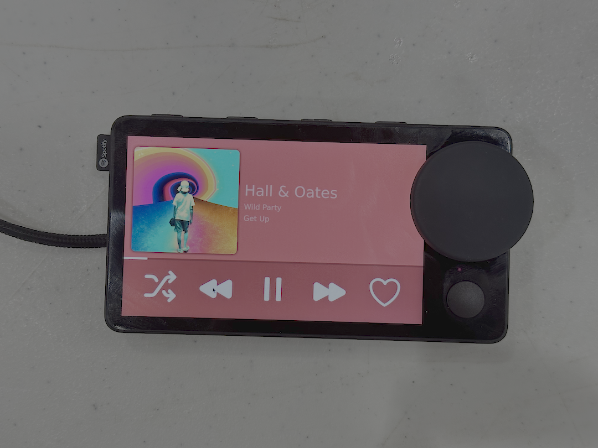

# Car Thang

Hawk Tuah, revive that Car Thing.

Car Thang is the first fully tether-free mod for the Spotify Car Thing. It does not require a computer to operate, and can be used just off your phone's Bluetooth just like the original. It can also join your phone's hotspot for internet-connected functionality.

This project was started for HackNC 2024. There is a lot more that needs to happen in order to make this project usable by a wider audience, as the installation process is quite involved at the moment. [View the HackNC Submission](https://devpost.com/software/car-thang)

If you would like to support the development of Car Thang, please consider sending us any old Car Things you may have lying around.

## Gallery (alpha version)




## Features

OS:

- [x] Easy install script
- [x] Full Linux distribution
- [x] Bluetooth tethering for internet

App:

- [] Control Bluetooth media without internet
- [] Spotify integration with internet

More features coming soon!

## Installation

Once this project is finished we will make a one-click install script that will flash Linux to your Car Thing and get you all set up.

In the meantime, if you are great at Linux, check out [alexcaoys](https://github.com/alexcaoys)'s [notes-superbird](https://github.com/alexcaoys/notes-superbird). You will probably be able to figure something out from there.

## Building

Requirements:

- Rust (app)
- Nix (OS)
- Aarch64-linux system or QEMU (OS)

Building this project requires either an aarch64-linux machine or QEMU on Linux. You can check if you have QEMU binfmt set up by running `ls /proc/sys/fs/binfmt_misc/` and ensuring that `qemu-aarch64` is present.

Add this line to your `/etc/nix/nix.conf` and restart the Nix daemon:

```none
extra-platforms = aarch64-linux
```

We have only tested builds on Linux at the moment, but plan to add MacOS and possibly Windows (via WSL2) support.

## Project Structure

```sh
car_thang/
├── app
│   └── # the new spotify app, written in rust
├── install
│   └── # the installation application, written in terrible python
└── nix
    └── # all of the nix files to build the custom nixos image
```

## Bluetooth

This app will soon support both Bluetooth media and Bluetooth PAN to emulate the exact functionality of the original Car Thing.

Just leaving this here for safekeeping for now:

`dbus-send --system --type=method_call --dest=org.bluez /org/bluez/hci0/dev_<MAC_ADDRESS> org.bluez.Network1.Connect string:'nap'`

## Notes

To make the install easier, we committed the SSH keys that the devices will use. This is not a problem as the only way to connect to this device is via USB.

## Prior Art

We would like to give a massive shoutout to [alexcaoys](https://github.com/alexcaoys). Their work on the [linux-superbird-6.6.y](https://github.com/alexcaoys/linux-superbird-6.6.y) kernel made this entire project possible.

We also must acknowledge the work [bishopdynamics](https://github.com/bishopdynamics) did on [superbird-tool](https://github.com/bishopdynamics/superbird-tool) and of course [frederic](https://github.com/frederic) for introducing Car Thing hacking to the world.
